# 数据流与交互图解

本文档使用 Mermaid 图表详细展示 `pi` 项目的数据流和交互模式。

## 目录

1. [整体架构](#整体架构)
2. [消息生命周期](#消息生命周期)
3. [Agent 循环详解](#agent-循环详解)
4. [工具执行流程](#工具执行流程)
5. [Provider 交互](#provider-交互)
6. [事件系统](#事件系统)
7. [流式处理](#流式处理)

---

## 整体架构

### 包依赖关系

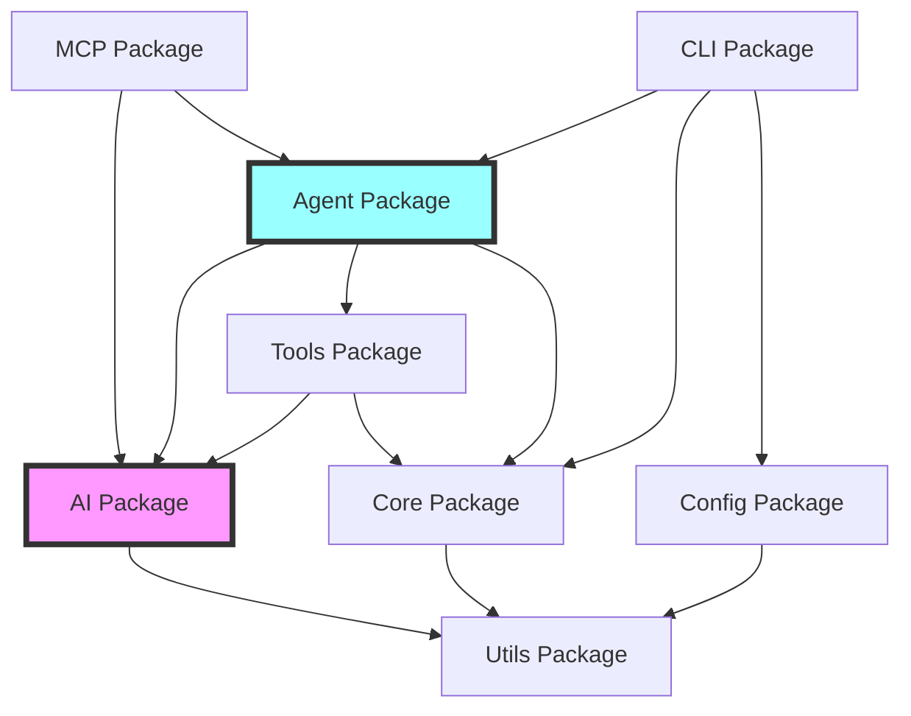
```mermaid
graph TB
    CLI[CLI Package]
    Agent[Agent Package]
    AI[AI Package]
    Tools[Tools Package]
    Core[Core Package]
    Config[Config Package]
    Utils[Utils Package]
    MCP[MCP Package]
    
    CLI --> Agent
    CLI --> Core
    CLI --> Config
    
    Agent --> AI
    Agent --> Tools
    Agent --> Core
    
    Tools --> AI
    Tools --> Core
    
    MCP --> AI
    MCP --> Agent
    
    AI --> Utils
    
    Core --> Utils
    Config --> Utils
    
    style AI fill:#f9f,stroke:#333,stroke-width:4px
    style Agent fill:#9ff,stroke:#333,stroke-width:4px
```

### 运行时组件关系

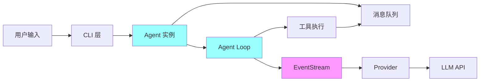
```mermaid
graph LR
    User[用户输入]
    CLI[CLI 层]
    Agent[Agent 实例]
    Queue[消息队列]
    Loop[Agent Loop]
    Stream[EventStream]
    Provider[Provider]
    LLM[LLM API]
    Tools[工具执行]
    
    User --> CLI
    CLI --> Agent
    Agent --> Queue
    Agent --> Loop
    Loop --> Stream
    Stream --> Provider
    Provider --> LLM
    Loop --> Tools
    Tools --> Queue
    
    style Agent fill:#9ff
    style Loop fill:#9ff
    style Stream fill:#f9f
```

---

## 消息生命周期

### 消息类型转换

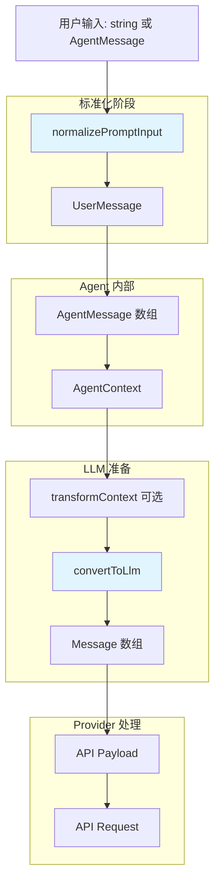
```mermaid
graph TD
    Input[用户输入: string 或 AgentMessage]
    
    subgraph "标准化阶段"
        Normalize[normalizePromptInput]
        UserMsg[UserMessage]
    end
    
    subgraph "Agent 内部"
        AgentMsg[AgentMessage 数组]
        Context[AgentContext]
    end
    
    subgraph "LLM 准备"
        Transform[transformContext 可选]
        Convert[convertToLlm]
        LLMMsg[Message 数组]
    end
    
    subgraph "Provider 处理"
        Payload[API Payload]
        API[API Request]
    end
    
    Input --> Normalize
    Normalize --> UserMsg
    UserMsg --> AgentMsg
    AgentMsg --> Context
    Context --> Transform
    Transform --> Convert
    Convert --> LLMMsg
    LLMMsg --> Payload
    Payload --> API
    
    style Normalize fill:#e1f5ff
    style Convert fill:#e1f5ff
```

### 消息流转时序

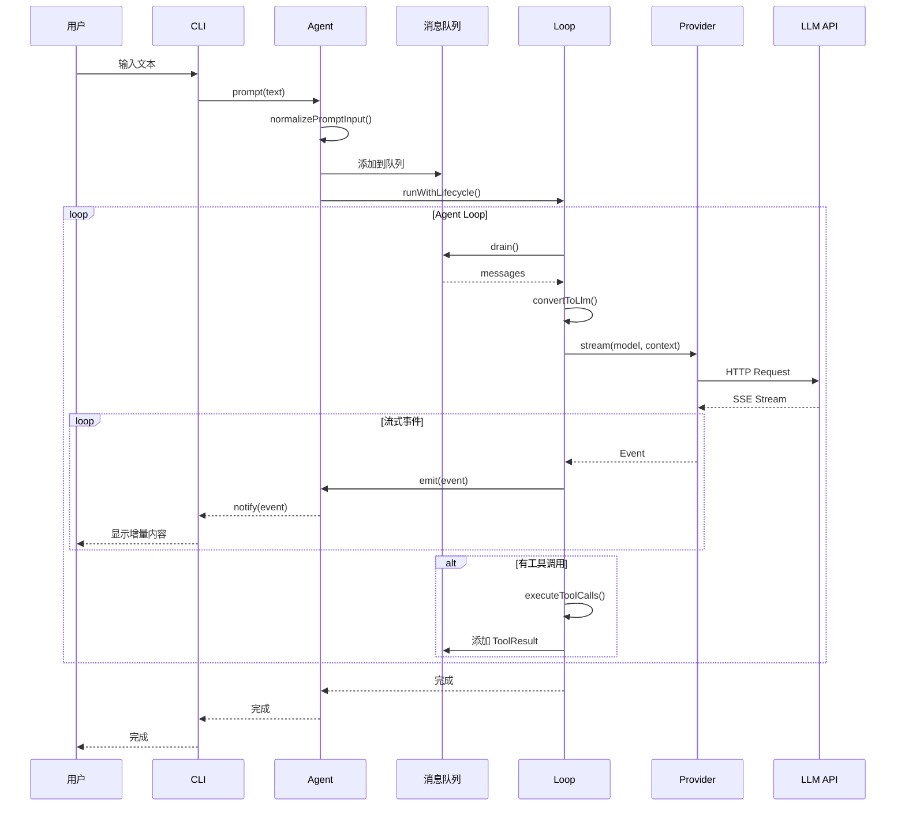
```mermaid
sequenceDiagram
    participant U as 用户
    participant CLI as CLI
    participant A as Agent
    participant Q as 消息队列
    participant L as Loop
    participant P as Provider
    participant LLM as LLM API
    
    U->>CLI: 输入文本
    CLI->>A: prompt(text)
    A->>A: normalizePromptInput()
    A->>Q: 添加到队列
    A->>L: runWithLifecycle()
    
    loop Agent Loop
        L->>Q: drain()
        Q-->>L: messages
        L->>L: convertToLlm()
        L->>P: stream(model, context)
        P->>LLM: HTTP Request
        LLM-->>P: SSE Stream
        
        loop 流式事件
            P-->>L: Event
            L->>A: emit(event)
            A-->>CLI: notify(event)
            CLI-->>U: 显示增量内容
        end
        
        alt 有工具调用
            L->>L: executeToolCalls()
            L->>Q: 添加 ToolResult
        end
    end
    
    L-->>A: 完成
    A-->>CLI: 完成
    CLI-->>U: 完成
```

---

## Agent 循环详解

### 主循环流程图

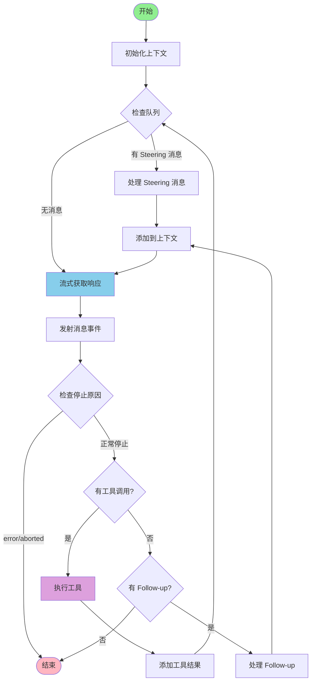
```mermaid
flowchart TD
    Start([开始]) --> Init[初始化上下文]
    Init --> CheckQueue{检查队列}
    
    CheckQueue -->|有 Steering 消息| ProcessSteering[处理 Steering 消息]
    CheckQueue -->|无消息| StreamResponse[流式获取响应]
    
    ProcessSteering --> AddToContext[添加到上下文]
    AddToContext --> StreamResponse
    
    StreamResponse --> EmitMessage[发射消息事件]
    EmitMessage --> CheckStop{检查停止原因}
    
    CheckStop -->|error/aborted| End([结束])
    CheckStop -->|正常停止| CheckTools{有工具调用?}
    
    CheckTools -->|是| ExecuteTools[执行工具]
    CheckTools -->|否| CheckFollowUp{有 Follow-up?}
    
    ExecuteTools --> AddToolResults[添加工具结果]
    AddToolResults --> CheckQueue
    
    CheckFollowUp -->|是| ProcessFollowUp[处理 Follow-up]
    CheckFollowUp -->|否| End
    
    ProcessFollowUp --> AddToContext
    
    style Start fill:#90EE90
    style End fill:#FFB6C1
    style StreamResponse fill:#87CEEB
    style ExecuteTools fill:#DDA0DD
```

### Steering vs Follow-up 队列

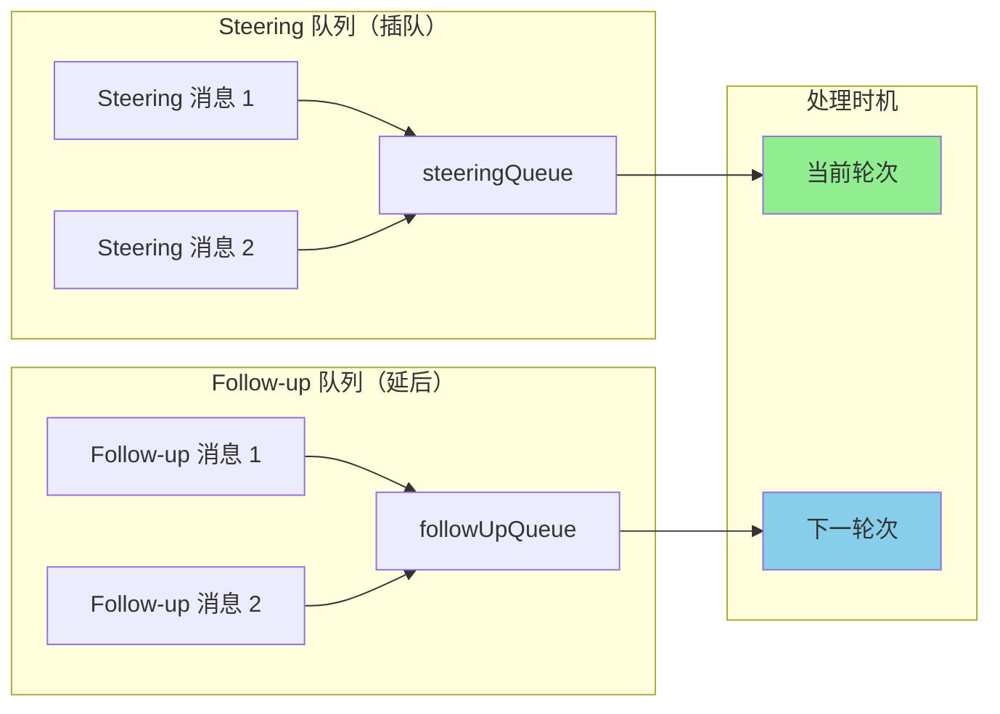
```mermaid
graph LR
    subgraph "Steering 队列（插队）"
        S1[Steering 消息 1]
        S2[Steering 消息 2]
        SteeringQueue[steeringQueue]
        S1 --> SteeringQueue
        S2 --> SteeringQueue
    end
    
    subgraph "Follow-up 队列（延后）"
        F1[Follow-up 消息 1]
        F2[Follow-up 消息 2]
        FollowUpQueue[followUpQueue]
        F1 --> FollowUpQueue
        F2 --> FollowUpQueue
    end
    
    subgraph "处理时机"
        CurrentTurn[当前轮次]
        NextTurn[下一轮次]
    end
    
    SteeringQueue --> CurrentTurn
    FollowUpQueue --> NextTurn
    
    style CurrentTurn fill:#90EE90
    style NextTurn fill:#87CEEB
```

### 队列模式详解

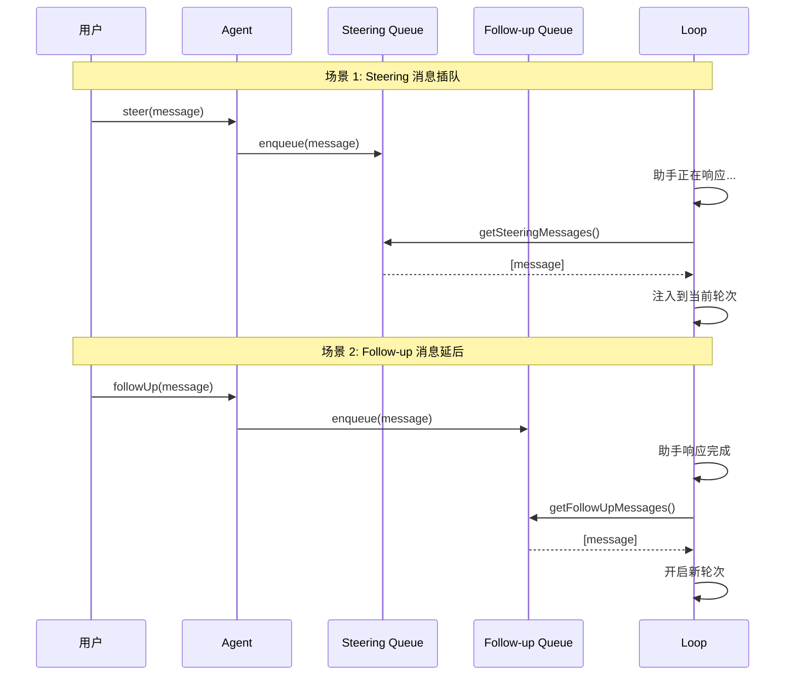
```mermaid
sequenceDiagram
    participant U as 用户
    participant A as Agent
    participant SQ as Steering Queue
    participant FQ as Follow-up Queue
    participant L as Loop
    
    Note over U,L: 场景 1: Steering 消息插队
    U->>A: steer(message)
    A->>SQ: enqueue(message)
    
    L->>L: 助手正在响应...
    L->>SQ: getSteeringMessages()
    SQ-->>L: [message]
    L->>L: 注入到当前轮次
    
    Note over U,L: 场景 2: Follow-up 消息延后
    U->>A: followUp(message)
    A->>FQ: enqueue(message)
    
    L->>L: 助手响应完成
    L->>FQ: getFollowUpMessages()
    FQ-->>L: [message]
    L->>L: 开启新轮次
```

---

## 工具执行流程

### 并行 vs 串行执行

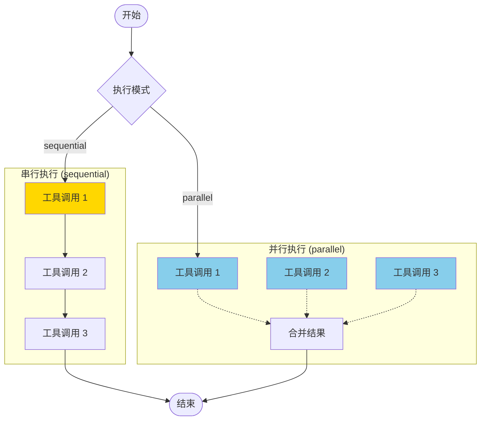
```mermaid
graph TD
    subgraph "串行执行 (sequential)"
        S1[工具调用 1]
        S2[工具调用 2]
        S3[工具调用 3]
        S1 --> S2 --> S3
    end
    
    subgraph "并行执行 (parallel)"
        P1[工具调用 1]
        P2[工具调用 2]
        P3[工具调用 3]
        P1 -.-> Merge[合并结果]
        P2 -.-> Merge
        P3 -.-> Merge
    end
    
    Start([开始]) --> Choice{执行模式}
    Choice -->|sequential| S1
    Choice -->|parallel| P1
    S3 --> End([结束])
    Merge --> End
    
    style S1 fill:#FFD700
    style P1 fill:#87CEEB
    style P2 fill:#87CEEB
    style P3 fill:#87CEEB
```

### 工具执行详细时序

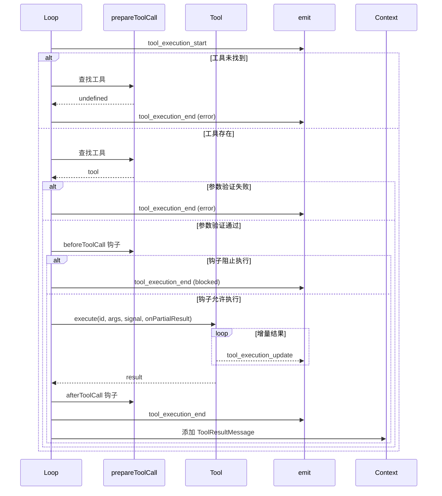
```mermaid
sequenceDiagram
    participant L as Loop
    participant P as prepareToolCall
    participant T as Tool
    participant E as emit
    participant C as Context
    
    L->>E: tool_execution_start
    
    alt 工具未找到
        L->>P: 查找工具
        P-->>L: undefined
        L->>E: tool_execution_end (error)
    else 工具存在
        L->>P: 查找工具
        P-->>L: tool
        
        alt 参数验证失败
            L->>E: tool_execution_end (error)
        else 参数验证通过
            L->>P: beforeToolCall 钩子
            
            alt 钩子阻止执行
                L->>E: tool_execution_end (blocked)
            else 钩子允许执行
                L->>T: execute(id, args, signal, onPartialResult)
                
                loop 增量结果
                    T-->>E: tool_execution_update
                end
                
                T-->>L: result
                L->>P: afterToolCall 钩子
                L->>E: tool_execution_end
                L->>C: 添加 ToolResultMessage
            end
        end
    end
```

### 工具钩子系统

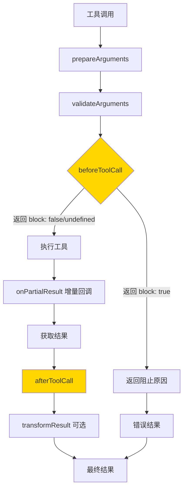
```mermaid
graph TD
    ToolCall[工具调用] --> Prepare[prepareArguments]
    Prepare --> Validate[validateArguments]
    Validate --> Before{beforeToolCall}
    
    Before -->|返回 block: true| Blocked[返回阻止原因]
    Before -->|返回 block: false/undefined| Execute[执行工具]
    
    Execute --> Partial[onPartialResult 增量回调]
    Partial --> Result[获取结果]
    Result --> After[afterToolCall]
    
    After --> Transform[transformResult 可选]
    Transform --> Final[最终结果]
    
    Blocked --> ErrorResult[错误结果]
    ErrorResult --> Final
    
    style Before fill:#FFD700
    style After fill:#FFD700
```

---

## Provider 交互

### Provider 选择机制

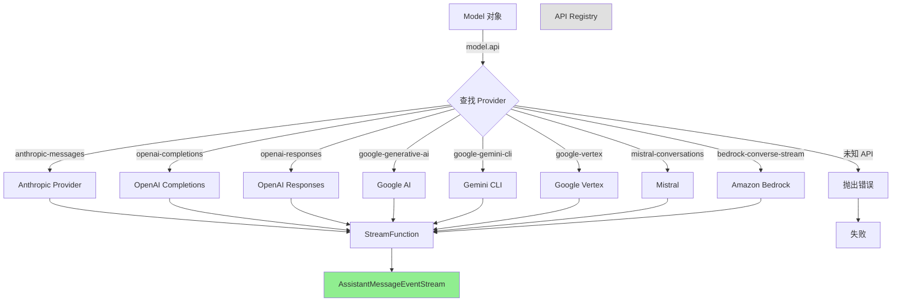
```mermaid
flowchart TD
    Model[Model 对象]
    Registry[API Registry]
    
    Model -->|model.api| Lookup{查找 Provider}
    Lookup -->|anthropic-messages| Anthropic[Anthropic Provider]
    Lookup -->|openai-completions| OpenAI[OpenAI Completions]
    Lookup -->|openai-responses| OpenAIResp[OpenAI Responses]
    Lookup -->|google-generative-ai| Google[Google AI]
    Lookup -->|google-gemini-cli| GeminiCli[Gemini CLI]
    Lookup -->|google-vertex| Vertex[Google Vertex]
    Lookup -->|mistral-conversations| Mistral[Mistral]
    Lookup -->|bedrock-converse-stream| Bedrock[Amazon Bedrock]
    Lookup -->|未知 API| Error[抛出错误]
    
    Anthropic --> StreamFn[StreamFunction]
    OpenAI --> StreamFn
    OpenAIResp --> StreamFn
    Google --> StreamFn
    GeminiCli --> StreamFn
    Vertex --> StreamFn
    Mistral --> StreamFn
    Bedrock --> StreamFn
    Error --> Failure[失败]
    
    StreamFn --> EventStream[AssistantMessageEventStream]
    
    style Registry fill:#E0E0E0
    style EventStream fill:#90EE90
```

### Provider 实现契约

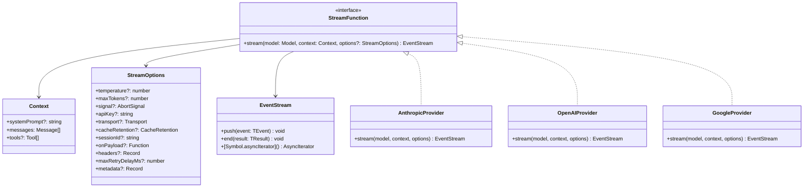
```mermaid
classDiagram
    class StreamFunction {
        <<interface>>
        +stream(model: Model, context: Context, options?: StreamOptions) EventStream
    }
    
    class Context {
        +systemPrompt?: string
        +messages: Message[]
        +tools?: Tool[]
    }
    
    class StreamOptions {
        +temperature?: number
        +maxTokens?: number
        +signal?: AbortSignal
        +apiKey?: string
        +transport?: Transport
        +cacheRetention?: CacheRetention
        +sessionId?: string
        +onPayload?: Function
        +headers?: Record
        +maxRetryDelayMs?: number
        +metadata?: Record
    }
    
    class EventStream {
        +push(event: TEvent) void
        +end(result: TResult) void
        +[Symbol.asyncIterator]() AsyncIterator
    }
    
    StreamFunction --> Context
    StreamFunction --> StreamOptions
    StreamFunction --> EventStream
    
    class AnthropicProvider {
        +stream(model, context, options) EventStream
    }
    
    class OpenAIProvider {
        +stream(model, context, options) EventStream
    }
    
    class GoogleProvider {
        +stream(model, context, options) EventStream
    }
    
    StreamFunction <|.. AnthropicProvider
    StreamFunction <|.. OpenAIProvider
    StreamFunction <|.. GoogleProvider
```

### 流式事件转换

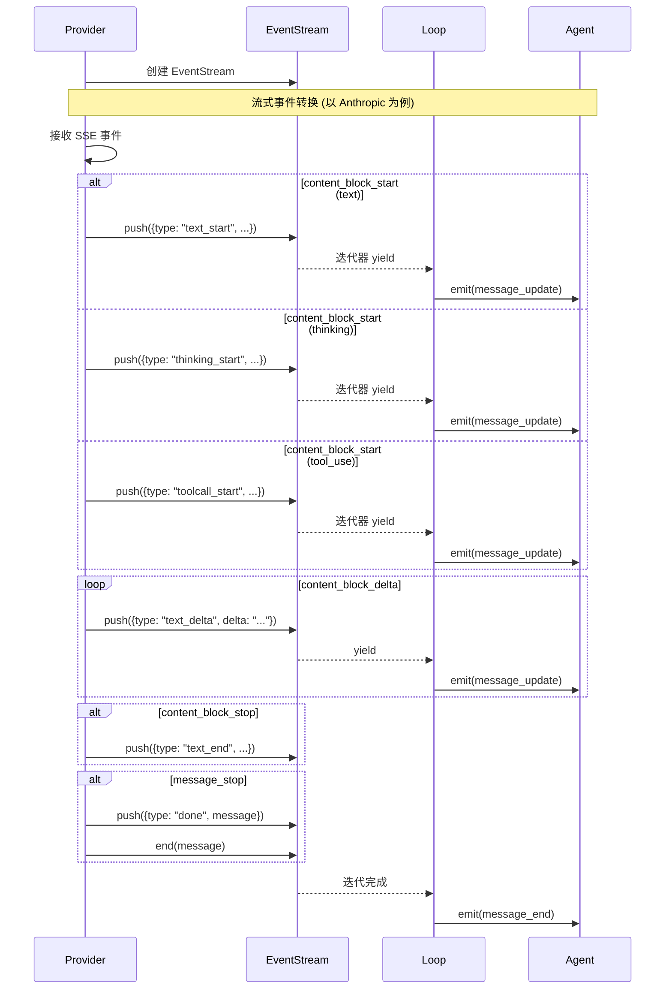
```mermaid
sequenceDiagram
    participant P as Provider
    participant S as EventStream
    participant L as Loop
    participant A as Agent
    
    P->>S: 创建 EventStream
    
    Note over P,A: 流式事件转换 (以 Anthropic 为例)
    
    P->>P: 接收 SSE 事件
    
    alt content_block_start (text)
        P->>S: push({type: "text_start", ...})
        S-->>L: 迭代器 yield
        L->>A: emit(message_update)
    else content_block_start (thinking)
        P->>S: push({type: "thinking_start", ...})
        S-->>L: 迭代器 yield
        L->>A: emit(message_update)
    else content_block_start (tool_use)
        P->>S: push({type: "toolcall_start", ...})
        S-->>L: 迭代器 yield
        L->>A: emit(message_update)
    end
    
    loop content_block_delta
        P->>S: push({type: "text_delta", delta: "..."})
        S-->>L: yield
        L->>A: emit(message_update)
    end
    
    alt content_block_stop
        P->>S: push({type: "text_end", ...})
    end
    
    alt message_stop
        P->>S: push({type: "done", message})
        P->>S: end(message)
    end
    
    S-->>L: 迭代完成
    L->>A: emit(message_end)
```

---

## 事件系统

### AgentEvent 类型层次

```mermaid
graph TD
    AgentEvent[AgentEvent]
    
    AgentEvent --> AgentStart[agent_start]
    AgentEvent --> AgentEnd[agent_end]
    AgentEvent --> TurnStart[turn_start]
    AgentEvent --> TurnEnd[turn_end]
    AgentEvent --> MessageStart[message_start]
    AgentEvent --> MessageEnd[message_end]
    AgentEvent --> MessageUpdate[message_update]
    AgentEvent --> ToolExecStart[tool_execution_start]
    AgentEvent --> ToolExecEnd[tool_execution_end]
    AgentEvent --> ToolExecUpdate[tool_execution_update]
    
    AgentEnd --> MessagesField[messages: AgentMessage数组]
    TurnEnd --> TurnMsgField[message: AssistantMessage]
    TurnEnd --> ToolResultsField[toolResults: ToolResultMessage数组]
    MessageStart --> MsgField[message: AgentMessage]
    MessageEnd --> MsgField
    MessageUpdate --> MsgField
    MessageUpdate --> EventField[assistantMessageEvent: AssistantMessageEvent]
    ToolExecStart --> ToolCallId[toolCallId]
    ToolExecStart --> ToolName[toolName]
    ToolExecStart --> ToolArgs[args]
    ToolExecEnd --> ToolCallId
    ToolExecEnd --> ToolName
    ToolExecEnd --> ToolResult[result]
    ToolExecEnd --> ToolIsError[isError]
    ToolExecUpdate --> ToolCallId
    ToolExecUpdate --> ToolName
    ToolExecUpdate --> ToolArgs
    ToolExecUpdate --> PartialResult[partialResult]
    
    style AgentEvent fill:#FFD700
    style AgentStart fill:#90EE90
    style AgentEnd fill:#FFB6C1
```

### 事件发射顺序

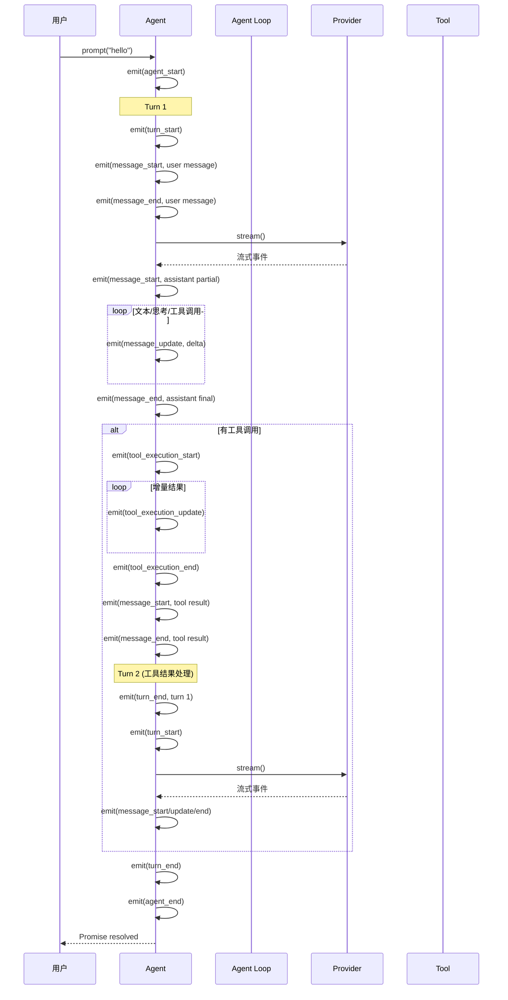
```mermaid
sequenceDiagram
    participant User as 用户
    participant Agent as Agent
    participant Loop as Agent Loop
    participant Provider as Provider
    participant Tool as Tool
    
    User->>Agent: prompt("hello")
    Agent->>Agent: emit(agent_start)
    
    Note over Agent: Turn 1
    Agent->>Agent: emit(turn_start)
    Agent->>Agent: emit(message_start, user message)
    Agent->>Agent: emit(message_end, user message)
    
    Agent->>Provider: stream()
    
    Provider-->>Agent: 流式事件
    Agent->>Agent: emit(message_start, assistant partial)
    
    loop 文本/思考/工具调用
        Agent->>Agent: emit(message_update, delta)
    end
    
    Agent->>Agent: emit(message_end, assistant final)
    
    alt 有工具调用
        Agent->>Agent: emit(tool_execution_start)
        
        loop 增量结果
            Agent->>Agent: emit(tool_execution_update)
        end
        
        Agent->>Agent: emit(tool_execution_end)
        Agent->>Agent: emit(message_start, tool result)
        Agent->>Agent: emit(message_end, tool result)
        
        Note over Agent: Turn 2 (工具结果处理)
        Agent->>Agent: emit(turn_end, turn 1)
        Agent->>Agent: emit(turn_start)
        
        Agent->>Provider: stream()
        Provider-->>Agent: 流式事件
        Agent->>Agent: emit(message_start/update/end)
    end
    
    Agent->>Agent: emit(turn_end)
    Agent->>Agent: emit(agent_end)
    Agent-->>User: Promise resolved
```

### 事件监听器模式

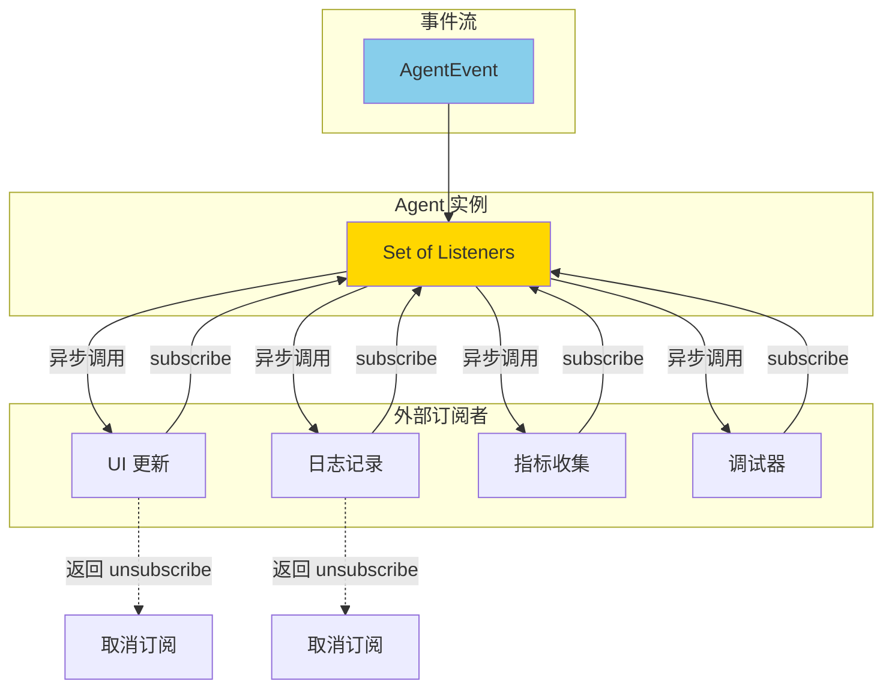
```mermaid
graph TD
    subgraph "Agent 实例"
        Listeners[Set of Listeners]
    end
    
    subgraph "外部订阅者"
        UI[UI 更新]
        Logger[日志记录]
        Metrics[指标收集]
        Debugger[调试器]
    end
    
    UI -->|subscribe| Listeners
    Logger -->|subscribe| Listeners
    Metrics -->|subscribe| Listeners
    Debugger -->|subscribe| Listeners
    
    subgraph "事件流"
        Event[AgentEvent]
    end
    
    Event --> Listeners
    Listeners -->|异步调用| UI
    Listeners -->|异步调用| Logger
    Listeners -->|异步调用| Metrics
    Listeners -->|异步调用| Debugger
    
    UI -.->|返回 unsubscribe| Unsub1[取消订阅]
    Logger -.->|返回 unsubscribe| Unsub2[取消订阅]
    
    style Listeners fill:#FFD700
    style Event fill:#87CEEB
```

---

## 流式处理

### EventStream 内部结构

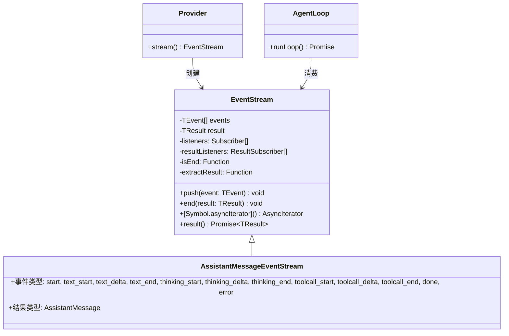
```mermaid
classDiagram
    class EventStream {
        -TEvent[] events
        -TResult result
        -listeners: Subscriber[]
        -resultListeners: ResultSubscriber[]
        -isEnd: Function
        -extractResult: Function
        +push(event: TEvent) void
        +end(result: TResult) void
        +[Symbol.asyncIterator]() AsyncIterator
        +result() Promise~TResult~
    }
    
    class AssistantMessageEventStream {
        +事件类型: start, text_start, text_delta, text_end, thinking_start, thinking_delta, thinking_end, toolcall_start, toolcall_delta, toolcall_end, done, error
        +结果类型: AssistantMessage
    }
    
    EventStream <|-- AssistantMessageEventStream
    
    class Provider {
        +stream() EventStream
    }
    
    Provider --> EventStream : 创建
    
    class AgentLoop {
        +runLoop() Promise
    }
    
    AgentLoop --> EventStream :消费
```

### 流式处理流程

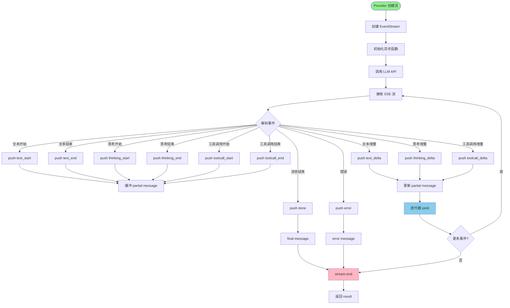
```mermaid
flowchart TD
    Start([Provider 创建流]) --> Create[创建 EventStream]
    Create --> Init[初始化异步函数]
    
    Init --> API[调用 LLM API]
    API --> SSE[接收 SSE 流]
    
    SSE --> Parse{解析事件}
    
    Parse -->|文本开始| TextStart[push text_start]
    Parse -->|文本增量| TextDelta[push text_delta]
    Parse -->|文本结束| TextEnd[push text_end]
    Parse -->|思考开始| ThinkStart[push thinking_start]
    Parse -->|思考增量| ThinkDelta[push thinking_delta]
    Parse -->|思考结束| ThinkEnd[push thinking_end]
    Parse -->|工具调用开始| ToolStart[push toolcall_start]
    Parse -->|工具调用增量| ToolDelta[push toolcall_delta]
    Parse -->|工具调用结束| ToolEnd[push toolcall_end]
    Parse -->|消息结束| Done[push done]
    Parse -->|错误| Error[push error]
    
    TextStart --> Buffer[缓冲 partial message]
    TextDelta --> Update[更新 partial message]
    TextEnd --> Buffer
    ThinkStart --> Buffer
    ThinkDelta --> Update
    ThinkEnd --> Buffer
    ToolStart --> Buffer
    ToolDelta --> Update
    ToolEnd --> Buffer
    
    Done --> Final[final message]
    Error --> ErrorMsg[error message]
    
    Final --> End[stream.end]
    ErrorMsg --> End
    
    Update --> Yield[迭代器 yield]
    Yield --> Loop{更多事件?}
    Loop -->|是| SSE
    Loop -->|否| End
    
    End --> Result[返回 result]
    
    style Start fill:#90EE90
    style End fill:#FFB6C1
    style Yield fill:#87CEEB
```

### 异步迭代器协议

```mermaid
sequenceDiagram
    participant Loop as Agent Loop
    participant Stream as EventStream
    participant Provider as Provider
    participant Buffer as 事件缓冲
    
    Loop->>Stream: for await (const event of stream)
    Stream->>Stream: 创建迭代器
    Stream->>Buffer: 等待事件
    
    Provider->>Stream: push(event1)
    Stream->>Buffer: 存储事件
    Stream-->>Loop: yield event1
    Loop->>Loop: 处理 event1
    
    Provider->>Stream: push(event2)
    Stream->>Buffer: 存储事件
    Stream-->>Loop: yield event2
    Loop->>Loop: 处理 event2
    
    Provider->>Stream: end(result)
    Stream->>Buffer: 标记结束
    Stream-->>Loop: 迭代结束
    Stream-->>Loop: result() 可用
    
    Loop->>Stream: stream.result()
    Stream-->>Loop: final result
```

### 流式错误处理

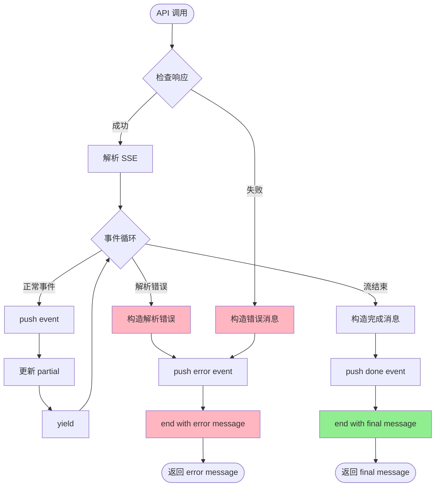
```mermaid
flowchart TD
    Start([API 调用]) --> Check{检查响应}
    
    Check -->|成功| Parse[解析 SSE]
    Check -->|失败| Error[构造错误消息]
    
    Parse --> Loop{事件循环}
    
    Loop -->|正常事件| Emit[push event]
    Loop -->|解析错误| ParseError[构造解析错误]
    Loop -->|流结束| Done[构造完成消息]
    
    Emit --> UpdateBuffer[更新 partial]
    UpdateBuffer --> Yield[yield]
    Yield --> Loop
    
    ParseError --> PushError[push error event]
    PushError --> EndError[end with error message]
    
    Done --> PushDone[push done event]
    PushDone --> EndSuccess[end with final message]
    
    Error --> PushError
    
    EndError --> Return([返回 error message])
    EndSuccess --> Return2([返回 final message])
    
    style Error fill:#FFB6C1
    style ParseError fill:#FFB6C1
    style EndError fill:#FFB6C1
    style EndSuccess fill:#90EE90
```

---

## 并发与取消

### AbortSignal 传播

```mermaid
graph TD
    User[用户请求中断] --> Agent[Agent.abort]
    Agent --> Controller[AbortController.abort]
    Controller --> Signal[AbortSignal]
    
    Signal --> Loop[Agent Loop]
    Signal --> Stream[Provider Stream]
    Signal --> Tool[Tool Execution]
    Signal --> Hooks[Lifecycle Hooks]
    
    Loop -->|检查 signal.aborted| LoopCheck{已取消?}
    LoopCheck -->|是| LoopCancel[清理并退出]
    LoopCheck -->|否| LoopContinue[继续执行]
    
    Stream -->|传递给 fetch| Fetch[HTTP Request]
    Fetch -->|signal triggered| FetchAbort[请求中止]
    FetchAbort --> StreamEnd[流结束 with error]
    
    Tool -->|传递给 execute| ToolExec[工具实现]
    ToolExec -->|检查 signal| ToolCheck{已取消?}
    ToolCheck -->|是| ToolCancel[中止操作]
    ToolCheck -->|否| ToolContinue[继续执行]
    
    Hooks -->|传递给监听器| HookExec[事件监听器]
    HookExec -->|检查 signal| HookCheck{已取消?}
    HookCheck -->|是| HookAbort[抛出 AbortError]
    HookCheck -->|否| HookRun[继续执行]
    
    style User fill:#FFB6C1
    style Signal fill:#FFD700
    style LoopCancel fill:#90EE90
```

### ActiveRun 管理

```mermaid
sequenceDiagram
    participant User as 用户
    participant Agent as Agent
    participant Run as ActiveRun
    participant Loop as Agent Loop
    
    User->>Agent: prompt("hello")
    
    alt 已有运行中
        Agent-->>User: Error: Agent is already processing
    else 空闲
        Agent->>Run: 创建 ActiveRun
        Agent->>Run: abortController = new AbortController()
        Agent->>Run: promise = new Promise()
        
        Agent->>Loop: runWithLifecycle(async (signal) => ...)
        Note over Run: 存储引用到 activeRun
        
        loop 事件处理
            Loop->>Agent: emit(event, signal)
        end
        
        alt 正常完成
            Loop-->>Agent: resolve
            Agent->>Run: promise.resolve()
        else 中止
            User->>Agent: abort()
            Agent->>Run: abortController.abort()
            Run-->>Loop: signal.aborted = true
            Loop-->>Agent: reject with AbortError
            Agent->>Run: promise.reject()
        end
        
        Agent->>Agent: activeRun = undefined
    end
```

---

## 缓存机制

### Prompt Caching 签名

```mermaid
graph TD
    subgraph "Turn 1"
        User1[User Message 1]
        Asst1[Assistant Message 1]
        
        User1 -->|包含| Text1[TextContent]
        Text1 -->|携带| Sig1[textSignature]
        
        Asst1 -->|包含| Thinking1[ThinkingContent]
        Thinking1 -->|携带| ThinkSig1[thinkingSignature]
    end
    
    subgraph "Turn 2"
        User2[User Message 2]
        Asst2[Assistant Message 2]
        
        User2 -->|发送给 LLM| Context2[Context]
        Context2 -->|包含| CachedSig1[Signatures from Turn 1]
        
        Note2[LLM 可以复用缓存]
        CachedSig1 -.-> Note2
        
        Asst2 -->|包含| Text2[TextContent]
        Text2 -->|携带| Sig2[textSignature]
    end
    
    subgraph "Turn 3"
        User3[User Message 3]
        Asst3[Assistant Message 3]
        
        User3 -->|发送给 LLM| Context3[Context]
        Context3 -->|包含| CachedSig2[Signatures from Turn 2]
        
        Note3[LLM 可以复用缓存]
        CachedSig2 -.-> Note3
    end
    
    style Sig1 fill:#FFD700
    style Sig2 fill:#FFD700
    style ThinkSig1 fill:#FFD700
    style CachedSig1 fill:#87CEEB
    style CachedSig2 fill:#87CEEB
```

### 缓存命中率优化

```mermaid
flowchart TD
    Start([接收响应]) --> Extract[提取 signatures]
    
    Extract --> TextSig{textSignature?}
    Extract --> ThinkSig{thinkingSignature?}
    
    TextSig -->|存在| StoreText[存储到 message]
    TextSig -->|不存在| SkipText[跳过]
    
    ThinkSig -->|存在| StoreThink[存储到 message]
    ThinkSig -->|不存在| SkipThink[跳过]
    
    StoreText --> CheckNext{更多内容块?}
    StoreThink --> CheckNext
    SkipText --> CheckNext
    SkipThink --> CheckNext
    
    CheckNext -->|是| Extract
    CheckNext -->|否| Prepare[准备下次请求]
    
    Prepare --> BuildContext[构建上下文]
    BuildContext --> AddSigs[添加 signatures 到请求]
    AddSigs --> Send[发送到 LLM]
    
    Send --> Response{LLM 响应}
    Response -->|命中缓存| CacheHit[Cache Read]
    Response -->|未命中| CacheMiss[Full Processing]
    
    CacheHit --> Usage[usage.cacheRead > 0]
    CacheMiss --> Usage2[usage.cacheRead = 0]
    
    Usage --> End([完成])
    Usage2 --> End
    
    style CacheHit fill:#90EE90
    style CacheMiss fill:#FFD700
```

---

## 总结

这些图表展示了 `pi` 项目的核心数据流和交互模式：

1. **消息流转**：从用户输入到 LLM API，再到最终输出
2. **事件驱动**：通过事件系统实现松耦合
3. **流式优先**：所有操作都支持实时流式处理
4. **并发控制**：通过 AbortSignal 实现可取消的操作
5. **队列管理**：Steering 和 Follow-up 队列实现灵活的消息注入
6. **缓存优化**：通过签名机制复用 LLM 计算

这些机制共同构成了一个高效、可扩展的 AI Agent 框架。
