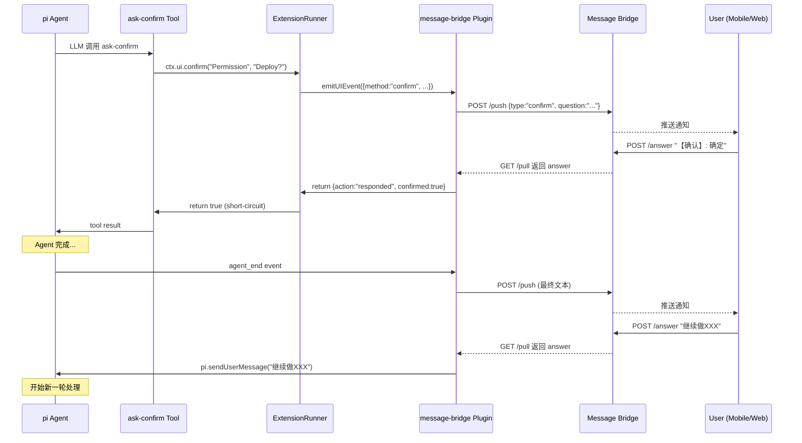

# Message Bridge UI 拦截插件

## 背景

pi-coding-agent 的扩展系统支持 `ui` 事件拦截机制。扩展可以通过 `pi.on("ui", handler)` 拦截 `ctx.ui.confirm()`、`ctx.ui.select()`、`ctx.ui.input()`、`ctx.ui.notify()` 调用，将 UI 交互转发到外部系统（如移动端、Web 控制台），实现远程裁决。

本插件将 pi 的 UI 交互桥接到 Message Bridge 服务，使 Agent 在执行过程中可以：
1. 将 confirm/select/input/notify 推送到移动端或 Web 控制台
2. 等待用户远程回复后注入结果
3. Agent 完成后将最终输出推送，用户可回复触发新任务

## Message Bridge 服务文档

> 详见：[Message Bridge README](../../extensions/message-bridge/README.md)
>
> 服务地址：`https://message-bridge.docker.19930810.xyz:8443`
>
> API 端点：
> - `POST /push` — 推送问题，返回消息 ID
> - `GET /pull/{msg_id}` — 长轮询拉取回复（阻塞直到用户回复）
> - `POST /answer/{msg_id}` — 提交回复
> - `GET /messages` — 获取消息历史

## 类型映射

| pi `ctx.ui` 方法 | Message Bridge 推送格式 | 回复解析 |
|---|---|---|
| `confirm(title, message)` | `{type: "confirm", question: "..."}` | `"【确认】: 确定"` → `confirmed: true`<br>`"【确认】: 取消"` → `confirmed: false` |
| `select(title, options)` | `{type: "radio", question: "...", options: [{label, description}]}` | `"【问题】: 选项A"` → `value: "选项A"` |
| `input(title, placeholder)` | 纯文本 `"{title}\n\nPlaceholder: {placeholder}"` | 直接返回 answer |
| `notify(message)` | 纯文本 | fire-and-forget，不等待回复 |

## 事件处理流程

### 1. UI 拦截（confirm/select/input）

```
Agent 调用 ctx.ui.confirm("Permission", "Deploy?")
  → pi 触发 ui 事件，调用 handler
  → handler 返回 {action: "responded", confirmed: true}
     （short-circuit：原始 UI 不会被调用）
  → 工具拿到 confirmed=true，继续执行
```

推荐写法（直接 await，不触发 race）：

```typescript
pi.on("ui", async (event, ctx) => {
    if (event.method === "confirm") {
        const question = { type: "confirm", question: `${event.title} - ${event.message}` };
        const id = await pushQuestion(question, sessionId);
        const answer = await pullAnswer(id);
        return { action: "responded", confirmed: parseConfirmAnswer(answer) };
    }
    // select, input 同理...
    return undefined;
});
```

### 2. Agent 结束推送

```
Agent 完成所有任务 → 触发 agent_end 事件
  → 插件将 assistant 回复拼接为纯文本
  → push 到 Message Bridge
  → pullAnswer 阻塞等待用户指令
  → 用户回复 "继续做XXX" → pi.sendUserMessage("继续做XXX")
  → Agent 开始新一轮处理
```

```typescript
pi.on("agent_end", async (event) => {
    const texts = event.messages
        .filter(m => m.role === "assistant")
        .map(m => extractText(m))
        .filter(t => t.trim());
    if (texts.length === 0) return;

    const id = await pushQuestion(texts.join("\n\n---\n\n"), sessionId);
    const answer = await pullAnswer(id);
    if (answer?.trim()) {
        pi.sendUserMessage(answer.trim());
    }
});
```

### 3. 时序图



## pi 扩展 API 参考

### 注册事件

```typescript
export default function myExtension(pi) {
    // 拦截 UI 事件
    pi.on("ui", async (event, ctx) => {
        // event.type: "ui"
        // event.id: string (唯一标识)
        // event.method: "confirm" | "select" | "input" | "notify"
        // event.title: string
        // event.message?: string
        // event.options?: string[]  (select 方法)
        // event.placeholder?: string (input 方法)

        // 返回 {action:"responded", ...} → short-circuit，原始 UI 不调用
        // 返回 undefined → 放行到原始 UI
        return { action: "responded", confirmed: true };
    });

    // 监听 Agent 结束
    pi.on("agent_end", async (event) => {
        // event.messages: AgentMessage[]
        // 可以提取 assistant 文本推送
    });
}
```

### 注册工具

```typescript
pi.registerTool({
    name: "ask-confirm",
    label: "Ask Confirm",
    description: "Asks a yes/no question",
    parameters: Type.Object({ question: Type.String() }),
    execute: async (id, params, signal, onUpdate, ctx) => {
        // ctx.ui.confirm() → 被 ui 事件拦截
        const confirmed = await ctx.ui.confirm("Title", params.question);
        return { content: [{ type: "text", text: confirmed ? "yes" : "no" }] };
    },
});
```

### UIEvent 类型

```typescript
interface UIEvent {
    type: "ui";
    id: string;
    method: "confirm" | "select" | "input" | "notify";
    title: string;
    message?: string;
    options?: string[];       // select
    placeholder?: string;     // input
    notifyType?: "info" | "warning" | "error";
}

type UIEventResult = { action: "responded"; confirmed?: boolean; value?: string } | undefined;
```

## 环境变量

| 变量 | 默认值 | 说明 |
|---|---|---|
| `MESSAGE_BRIDGE_URL` | `https://message-bridge.docker.19930810.xyz:8443` | Bridge 服务地址 |
| `MESSAGE_BRIDGE_SESSION_ID` | (空) | 可选 session 过滤 |

## 启用方式

```bash
# CLI
pi --extension ./extensions/message-bridge/index.ts

# settings.json
{ "extensions": ["./extensions/message-bridge/index.ts"] }
```

## 已验证场景

| # | 场景 | 方式 |
|---|---|---|
| 1 | confirm → confirmed=true | 单元测试 + E2E + 真实 pi |
| 2 | confirm → confirmed=false (取消) | 单元测试 + E2E |
| 3 | select → radio 单选 | 单元测试 + E2E + 真实 pi |
| 4 | select → 多选 JSON 解析 | 单元测试 |
| 5 | input → 纯文本回复 | 单元测试 + E2E |
| 6 | notify → fire-and-forget | 单元测试 + E2E |
| 7 | agent_end → 推送最终文本 | 真实 pi |
| 8 | agent_end → 回复触发 sendUserMessage 新任务 | 真实 pi |
