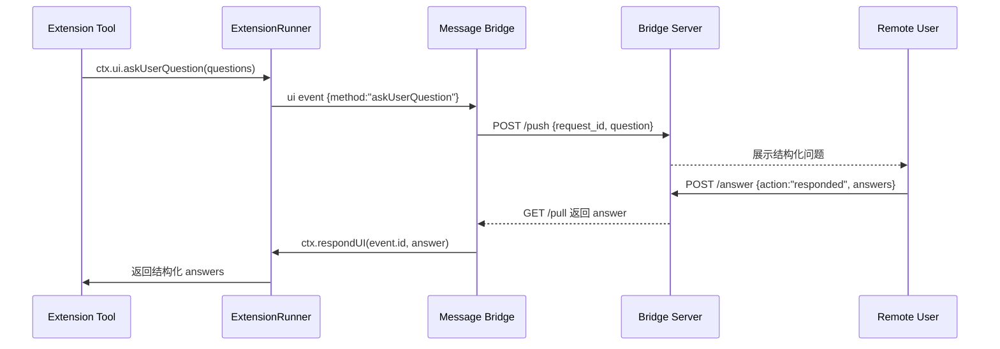
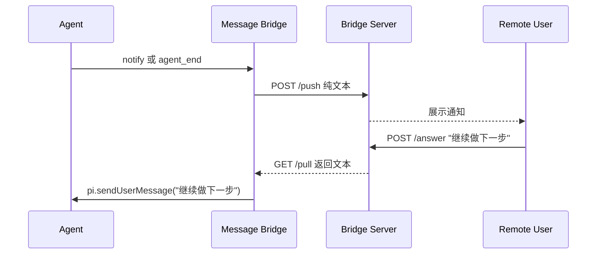

# Message Bridge Ask v2 插件

## 背景

pi-coding-agent 的扩展系统支持 `ui` 事件拦截机制。Message Bridge 插件只接管新的 `ctx.ui.askUserQuestion()` 协议，并把结构化问题转发到外部系统（移动端、Web 控制台或其他远程响应器）。

旧的 `confirm` / `select` / `input` / `editor` 不在 bridge 层做兼容转换。需要远程裁决的问题应在上游统一构造成 `askUserQuestion`。

权限审批、钩子审批和 Goal 人工授权共用这一条交互传输链路，但保留不同的语义元数据：

- `permissionMeta.type = "permission_runtime"`：普通工具权限或钩子触发的权限裁决。
- `permissionMeta.type = "path_boundary"`：项目边界之外的路径访问裁决。
- `permissionMeta.type = "goal_approval"`：Goal 合同、权限范围变更或一次性风险动作的人工授权；通过 `kind` 区分 `contract`、`authority_amendment`、`pending_risk`。

Goal 审批不是普通的单次工具权限，但它属于同一类“需要人确认的交互请求”，因此必须走同一个 `askUserQuestion`、请求 ID 和 `respondUI` 生命周期。这样本地 UI 与远程 Message Bridge 的第一个有效回复会竞争同一个请求，完成后所有客户端都能收到关闭事件。

本插件提供两类能力：

1. `askUserQuestion`：推送结构化问题，等待远程结构化回复，并通过 `ctx.respondUI()` 注入结果。
2. `notify` / `agent_end`：推送纯文本通知；`agent_end` 可接收用户回复并通过 `pi.sendUserMessage()` 触发新一轮。

## Message Bridge 服务

服务地址默认：

```txt
https://message-bridge.docker.19930810.xyz:8443
```

API 端点：

| Endpoint | 用途 |
| --- | --- |
| `POST /push` | 推送问题或通知，返回消息 ID |
| `GET /pull/{msg_id}` | 长轮询拉取回复 |
| `POST /answer/{msg_id}` | 提交回复 |
| `GET /messages` | 获取消息历史 |

## Ask v2 推送格式

插件向 `/push` 发送：

```json
{
  "request_id": "ui-request-id",
  "session_id": "optional-session-id",
  "question": {
    "type": "extension_ui_request",
    "id": "ui-request-id",
    "method": "askUserQuestion",
    "title": "Review deployment plan",
    "message": "请确认这次操作范围",
    "timeout": 60000,
    "toolCallId": "tool-call-id",
    "permissionMeta": {
      "type": "goal_approval",
      "kind": "contract",
      "goalId": "goal-123",
      "generation": 2,
      "objective": "验证部署计划"
    },
    "questions": [
      {
        "id": "scope",
        "header": "Scope",
        "question": "先处理哪边？",
        "options": [
          { "label": "Local", "description": "先做好本地" },
          { "label": "Remote", "description": "先对接远程" }
        ]
      },
      {
        "id": "checks",
        "header": "Checks",
        "question": "需要哪些验证？",
        "multiSelect": true,
        "options": [
          { "label": "Refresh", "description": "刷新恢复" },
          { "label": "Bridge", "description": "message bridge" }
        ]
      }
    ]
  }
}
```

## Ask v2 回复格式

`GET /pull/{msg_id}` 必须返回结构化 `answer`：

```json
{
  "id": "msg-id",
  "answer": {
    "action": "responded",
    "answers": {
      "scope": {
        "selected": ["Local"],
        "text": "ship local first"
      },
      "checks": {
        "selected": ["Refresh", "Bridge"]
      }
    },
    "annotations": {
      "checks": {
        "notes": "smoke note"
      }
    }
  }
}
```

如果 `answer` 不是对象，或缺少 `action: "responded"` / `answers`，插件会拒绝注入，避免把旧文本回复误当成 Ask v2。

## 事件处理流程

### 1. Ask v2 远程裁决


```mermaid
sequenceDiagram
    participant Tool as Extension Tool
    participant Runner as ExtensionRunner
    participant Plugin as Message Bridge
    participant Bridge as Bridge Server
    participant User as Remote User

    Tool->>Runner: ctx.ui.askUserQuestion(questions)
    Runner->>Plugin: ui event {method:"askUserQuestion"}
    Plugin->>Bridge: POST /push {request_id, question}
    Bridge-->>User: 展示结构化问题
    User->>Bridge: POST /answer {action:"responded", answers}
    Bridge-->>Plugin: GET /pull 返回 answer
    Plugin->>Runner: ctx.respondUI(event.id, answer)
    Runner->>Tool: 返回结构化 answers
```

### 2. 通知与 Agent 结束推送


```mermaid
sequenceDiagram
    participant Agent as Agent
    participant Plugin as Message Bridge
    participant Bridge as Bridge Server
    participant User as Remote User

    Agent->>Plugin: notify 或 agent_end
    Plugin->>Bridge: POST /push 纯文本
    Bridge-->>User: 展示通知
    User->>Bridge: POST /answer "继续做下一步"
    Bridge-->>Plugin: GET /pull 返回文本
    Plugin->>Agent: pi.sendUserMessage("继续做下一步")
```

## 扩展 API 参考

```typescript
export default function myExtension(pi) {
  pi.on("ui", async (event, ctx) => {
    if (event.method !== "askUserQuestion") return undefined;

    // 推送 event.questions 到远程系统，等远程返回 Ask v2 answer。
    ctx.respondUI(event.id, {
      action: "responded",
      answers: {
        scope: { selected: ["Local"] },
      },
    });

    return undefined;
  });

  pi.on("agent_end", async (event) => {
    // 提取 assistant 文本并推送；用户远程回复后可 pi.sendUserMessage(...)
  });
}
```

## 环境变量

| 变量 | 默认值 | 说明 |
| --- | --- | --- |
| `MESSAGE_BRIDGE_URL` | `https://message-bridge.docker.19930810.xyz:8443` | Bridge 服务地址 |
| `MESSAGE_BRIDGE_SESSION_ID` | 空 | 可选 session 过滤 |

## 启用方式

```bash
pi --extension ./extensions/message-bridge/index.ts
```

```json
{
  "extensions": ["./extensions/message-bridge/index.ts"]
}
```

## 已验证场景

| # | 场景 | 方式 |
| --- | --- | --- |
| 1 | `askUserQuestion` 原样推送 Ask v2 payload | 单元测试 |
| 2 | Ask v2 结构化回复注入 `ctx.respondUI` | 单元测试 |
| 3 | 非结构化旧文本回复被拒绝注入 | 单元测试 |
| 4 | 旧 `confirm/select/input/editor` 不再被 bridge 翻译 | 单元测试 |
| 5 | `notify` 纯文本 fire-and-forget | 单元测试 |
| 6 | `agent_end` 推送最终文本并接收回复 | 单元测试 |
